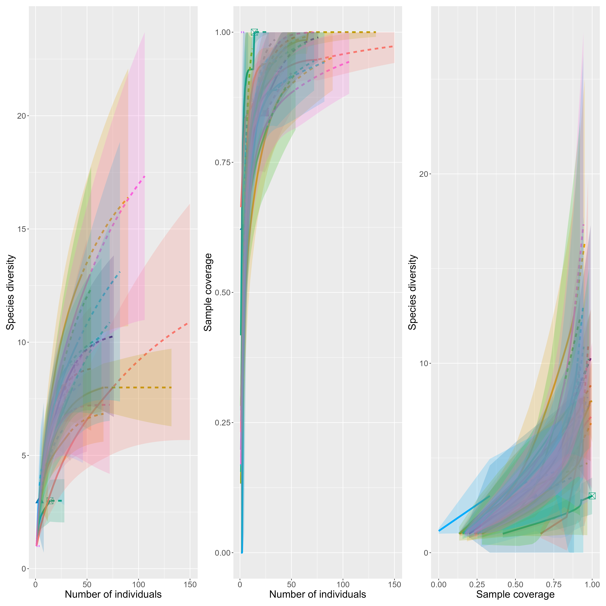

```{r}
#| echo: false
#| eval: true
#| warning: false
#| message: false
#| label: setup

knitr::opts_knit$set(root.dir = rprojroot::find_rstudio_root_file())

```

# Rarefaction

We have only 4 specialist species in our study. I rareified specialists and generalists separately, to obtain different abundance/diversity metrics for each group but this may not make biological sense.

Many sites have no specialist species. Of the sites that do, most of them have only one specialist species, which makes estimation of sampling coverage not robust. All sites were determined to have a sampling coverage of 1, displaying that the rareified calculations for specialists are most likely not accurate.

The removal of the specialist species did not impact the sampling coverage of the generalist species, which was rareified to 0.7521 for comparison.

Because of rarefaction, species richness values are no longer true counts but decimals. Species richness models are now general linear models with a Normal error distribution (instead of Poisson).

Shannon diversity now has niche breadth included in the models as we have rareified both niche groups.

Generalists:


Specialists:


# Multicollinearity

-   Collinearity was checked before creating models. All explanatory variables have a Pearson correlation score of \< 0.5.

-   VIF scores also look fine, not sure if we want to explicitly report them or just say everything looks good.

# Sampling Area

-   Sampling area values in data sheets (used for area variable in models) do not align with the pond area descriptions in methods. Values range from 1246 to 6966. I am not sure of the units or what these values represent. Potentially the green space area surrounding the pond? I remember Jesse working to delineate that.

-   We now account for sampling area re: rarefaction (i.e., sampling coverage is dependent on the area of sampling since we had a timed survey)

-   However, we also believe that area affects butterfly community not only through sampling coverage but through a direct mechanism. We expect that ponds of different sizes will have different abundances and species composition because of their size. Therefore, I have added area to the models. Though, as stated above I am not 100% sure what the metric of area represents.

-   I didn't add any interaction terms with sampling area in the models, but we could if we have a hypothesis supporting that. We just need to be wary of overfitting our models as we don't have very many observations.

# Overdispersion

-   Overdispersion detected in abundance models. I have switched from Poisson to negative binomial to address the issue. New model outputs below.

# New Model Results

Table 1. Model summaries of the effect of urbanization on butterfly communities. The first three columns display the results of the model with butterfly abundance as a response, the second three columns with butterfly species richness, and the last three columns with butterfly Shannon diversity. ‘Est’ indicates model estimate; ‘CI’ represents confidence intervals, which are 95 % for all models; ‘p’ indicates the p-value of that row’s variable. The estimates for the abundance model (1st column) are presented as incidence rate ratios (IRRs), where decimal numbers between 0 and 1 indicate negative relationships and numbers 1 and above indicate positive relationships. Anthropogenic Land Cover (%) represents the percentage of anthropogenic land cover surrounding the pond within a 400 m buffer. Niche breadth categories are presented in comparison to the intercept, which is the generalist niche for this table. ‘:’ in the table indicates an interaction effect.

```{r}
#| echo: false
#| eval: true
#| message: false
#| warning: false
#| label: table-1

source('script/0-Packages.R')

mod_ab_400 <- readRDS('large/UrbAbund_400.rds')
mod_n_sr_400 <- readRDS('large/UrbNicheSR_400.rds')
mod_sh_400 <- readRDS('large/UrbShann_400.rds')


modelsummary(list("Abundance" = mod_ab_400, "Species Richness" = mod_n_sr_400, "Shannon Diversity" = mod_sh_400),
             fmt = NULL,
             estimate = "{signif(estimate, 2)}",
             exponentiate = c(TRUE, FALSE, FALSE), 
             statistic = c("CI" = "({signif(conf.low, 2)}, {signif(conf.high, 2)})", 
                           "t-statistic" =  "{signif(statistic, 2)}", 
                           "p-value" = "{signif(p.value, 1)}"),
             conf_level = .95,
             shape = term ~ model + statistic,
             gof_map = c( "r2.nagelkerke", "adj.r.squared", "adj.r.squared"),
             coef_rename = c("anthroper_400" = "Anthropogenic Land Cover (%)",
                             "SamplingArea" = "Site Area (units)",
                             "Niche.BreadthSpecialist" = "Wetland specialist"))

```

```{r}
#| echo: false
#| eval: true
#| message: false
#| warning: false
#| fig-width: 10
#| fig-height: 10
#| label: figure-1

source('script/function-BasicPlot.R')

# Data --------------------------------------------------------------------
plant <- read.csv('output/PlantCleanbySite.csv') %>% 
  mutate(Pond = str_remove(Pond, "SWF-"),
         Pond = as.numeric(Pond))
anthro <- st_read("output/AnthroFull.gpkg", quiet = T)
butt <- read.csv('output/ButterflyCleanbySite.csv')

ab <- inner_join(anthro, butt, by = join_by("Pond" == "SWP"))
abp <- inner_join(ab, plant, by = "Pond")


# Species Richness

sr_an <- basic_plot(mod_n_sr_400, condition = c("anthroper_400", "Niche.Breadth"), colour = Niche.Breadth,
           dat = abp, x = anthroper_400, y = SpeciesRichness,
           xlab = "Anthropogenic Land Cover (%)", ylab = "Butterfly Species Richness") 


# Shannon
sh_an <- basic_plot(mod_sh_400, condition = c("anthroper_400", "Niche.Breadth"), 
                    colour = Niche.Breadth,
                    dat = abp, x = anthroper_400, y = Shannon,
                    xlab = "Anthropogenic Land Cover (%)", ylab = "Butterfly Shannon") 

sr_an + sh_an +  plot_layout(guides = 'collect') & theme(legend.position = "top")

```

Figure 1. Disturbance model results for a 400 m buffer surrounding ponds. The relationship between the interaction of percent anthropogenic land cover in the buffer and niche breadth and (a) rareified butterfly species richness; (b) rareified butterfly Shannon. Points are raw data from individual stormwater pond sites. Band indicates the 95% confidence interval. Plots made using the marginaleffects package and ggplot2 (Arel-Bundock et al., 2024; Wickham et al., 2016).

Table 2. Model summaries of the effect of total plant bloom on butterfly communities. The first three columns display the results of the model with butterfly abundance as a response, the second three columns with butterfly species richness, and the last three columns with butterfly Shannon diversity. ‘Est’ indicates model estimate; ‘CI’ represents confidence intervals, which are 95 % for all models; ‘p’ indicates the p-value of that row’s variable. The estimates for the abundance model (1st column) are presented as incidence rate ratios (IRRs), where decimal numbers between 0 and 1 indicate negative relationships and numbers 1 and above indicate positive relationships. Niche breadth categories are presented in comparison to the intercept, which is the generalist niche for this table. ‘:’ in the table indicates an interaction effect.

```{r}
#| echo: false
#| eval: true
#| label: table-2


mod_ab_tot <- readRDS('large/TotAbund.rds')
mod_n_sr_tot <- readRDS('large/TotNicheSR.rds')
mod_sh_tot <- readRDS('large/TotShann.rds')


modelsummary(list("Abundance" = mod_ab_tot, "Species Richness" = mod_n_sr_tot, "Shannon Diversity" = mod_sh_tot),
             fmt = NULL,
             estimate = "{signif(estimate, 2)}",
             exponentiate = c(TRUE, FALSE, FALSE), 
             statistic = c("CI" = "({signif(conf.low, 2)}, {signif(conf.high, 2)})", 
                           "t-statistic" =  "{signif(statistic, 2)}",
                           "p-value" = "{signif(p.value, 1)}"),
             conf_level = .95,
             shape = term ~ model + statistic,
             gof_map = c( "r2.nagelkerke", "adj.r.squared", "adj.r.squared"),
             coef_rename = c("nspecies" = "Number of Flowering Plant Species",
                               "avgbloom" = "Average Total Bloom Cover",
                             "SamplingArea" = "Site Area (units)",
                               "Niche.BreadthSpecialist" = "Wetland specialist"))

```

```{r}
#| echo: false
#| eval: true
#| message: false
#| warning: false
#| fig-width: 10
#| fig-height: 10
#| label: figure-2

# Abundance
ab_cov <- basic_plot(mod_ab_tot, condition = c("avgbloom"), 
           dat = abp, x = avgbloom, y = abund,
           xlab = "Average Total Bloom Cover", ylab = "Butterfly Abundance") 


# Species Richness

sr_ntot <- basic_plot(mod_n_sr_tot, condition = c("nspecies"), 
           dat = abp, x = nspecies, y = SpeciesRichness,
           xlab = "Number of Flowering Species", ylab = "Butterfly Species Richness") 

sr_cov <- basic_plot(mod_n_sr_tot, condition = c("avgbloom", "Niche.Breadth"), colour = Niche.Breadth,
           dat = abp, x = avgbloom, y = SpeciesRichness,
           xlab = "Average Total Bloom Cover", ylab = "Butterfly Species Richness") 


# Shannon
sh_ntot <- basic_plot(mod_sh_tot, condition = c("nspecies"), 
           dat = abp, x = nspecies, y = Shannon,
           xlab = "Number of Flowering Species", ylab = "Butterfly Shannon") 

sh_cov <- basic_plot(mod_sh_tot, condition = c("avgbloom"), 
           dat = abp, x = avgbloom, y = Shannon,
           xlab = "Average Total Bloom Cover", ylab = "Butterfly Shannon") 


sr_ntot + sr_cov + sh_ntot + sh_cov + ab_cov + plot_layout(ncol = 2, nrow =3, guides = 'collect') & theme(legend.position = "top")

```

Figure 2. Total plant community model results, (a) the relationship between butterfly species richness and number of flowering plant species; (b) butterfly species richness and average total bloom cover; (c) butterfly Shannon diversity and number of flowering plant species; (d) butterfly Shannon diversity and average total bloom cover; (e) butterfly abundance and average total bloom cover. Points are raw data for individual stormwater ponds. There are more points than ponds (n = 21) for abundance models because each pond has values for wetland specialist and generalist niche breadths, indicated by colour. Bands indicates the 95% confidence interval. Plots made using the marginaleffects package and ggplot2 (Arel-Bundock et al., 2024; Wickham et al., 2016)

Table 3. Model summaries of the effect of native plant bloom on butterfly communities. The first three columns display the results of the model with butterfly abundance as a response, the second three columns with butterfly species richness, and the last three columns with butterfly Shannon diversity. ‘Est’ indicates model estimate; ‘CI’ represents confidence intervals, which are 95 % for all models; ‘p’ indicates the p-value of that row’s variable. The estimates for the abundance model (1st column) are presented as incidence rate ratios (IRRs), where decimal numbers between 0 and 1 indicate negative relationships and numbers 1 and above indicate positive relationships. Niche breadth categories are presented in comparison to the intercept, which is the generalist niche for this table. ‘:’ in the table indicates an interaction effect.

```{r}
#| echo: false
#| eval: true
#| label: table-3


mod_ab_nat <- readRDS('large/NatAbund.rds')
mod_n_sr_nat <- readRDS('large/NatNicheSR.rds')
mod_sh_nat <- readRDS('large/NatShann.rds')


modelsummary(list("Abundance" = mod_ab_nat, "Species Richness" = mod_n_sr_nat, "Shannon Diversity" = mod_sh_nat),
             fmt = NULL,
             estimate = "{signif(estimate, 2)}",
             exponentiate = c(TRUE, FALSE, FALSE), 
             statistic = c("CI" = "({signif(conf.low, 2)}, {signif(conf.high, 2)})",
                           "t-statistic" =  "{signif(statistic, 2)}",
                           "p-value" = "{signif(p.value, 1)}"),
             conf_level = .95,
             shape = term ~ model + statistic,
             gof_map = c( "r2.nagelkerke", "adj.r.squared", "adj.r.squared"),
             coef_rename = c("nnative" = "Number of Native Flowering Species",
                             "avgnatbloom" = "Average Native Bloom Cover",
                             "SamplingArea" = "Site Area (units)",
                             "Niche.BreadthSpecialist" = "Wetland specialist"))

```

```{r}
#| echo: false
#| eval: true
#| message: false
#| warning: false
#| fig-width: 10
#| fig-height: 10
#| label: figure-3

# Abundance
ab_nnat <- basic_plot(mod_ab_nat, condition = c("nnative"), 
           dat = abp, x = nnative, y = abund,
           xlab = "Number of Native Flowering Species", ylab = "Butterfly Abundance") 


# Shannon
ab_natcov <- basic_plot(mod_ab_nat, condition = c("avgnatbloom"),
                    dat = abp, x = avgnatbloom, y = abund,
                    xlab = "Average Native Bloom Cover", ylab = "Butterfly Abundance") 

ab_nnat + ab_natcov 

```

Figure 3. Native plant community models showing the relationship between butterfly abundance and (a) number of native flowering plant species; (b) average native bloom cover. Points are raw data from individual stormwater pond sites. There are more points than ponds (n = 21) because each pond has values for wetland-specialist and generalist niche breadths. Grey, bands indicate the 95% confidence interval. Plots made using the marginaleffects package and ggplot2 (Arel-Bundock et al., 2024; Wickham et al., 2016).

## Major Changes

**Urbanization models:**

-   No longer a relationship between abundance and urbanization

-   Now a significant interaction effect with species richness and urbanization/niche breadth

-   Now a significant effect of urbanization/niche breadth on Shannon

**Total plant models:**

-   No longer an effect of number of flowering plant species or niche breadth on abundance

-   Now a significant effect of number of flowering plant species and average bloom cover on species richness

-   Average bloom cover now has a significant effect on Shannon

**Native plant models:**

-   Abundance model no longer has a significant effect/interaction with niche breadth

-   Number of native flowering species no longer has a significant relationship with species richness

# White Cabbage

We want to see how large of an effect the overwhelming abundance of white cabbage is having on our results. I ran all of the same analyses **without** *Pieris rapae* in the dataset.

-   minimum sampling coverage for generalists drops from 0.7651 to 0.3333



## Urbanization Model

```{r}
#| echo: false
#| eval: true
#| message: false
#| warning: false
#| label: urb-cw


anthro <- st_read("output/AnthroFull.gpkg", quiet = T)
butt_cw <- read.csv('output/ButterflyCleanbySite_noCW.csv')

ab <- inner_join(anthro, butt_cw, by = join_by("Pond" == "SWP"))

# Model -------------------------------------------------------------------

mod_ab_400_cw <- glm.nb(abund ~ 1 + anthroper_400 * Niche.Breadth + SamplingArea, data = ab)
mod_n_sr_400_cw <- lm(SpeciesRichness ~ 1 + anthroper_400 * Niche.Breadth + SamplingArea, data = ab)
mod_sh_400_cw <- lm(Shannon ~ 1 + anthroper_400 * Niche.Breadth + SamplingArea, data = ab)


modelsummary(list("Abundance" = mod_ab_400_cw, "Species Richness" = mod_n_sr_400_cw, "Shannon Diversity" = mod_sh_400_cw),
             fmt = NULL,
             estimate = "{signif(estimate, 2)}",
             exponentiate = c(TRUE, FALSE, FALSE), 
             statistic = c("CI" = "({signif(conf.low, 2)}, {signif(conf.high, 2)})", 
                           "t-statistic" =  "{signif(statistic, 2)}", 
                           "p-value" = "{signif(p.value, 1)}"),
             conf_level = .95,
             shape = term ~ model + statistic,
             gof_map = c( "r2.nagelkerke", "adj.r.squared", "adj.r.squared"),
             coef_rename = c("anthroper_400" = "Anthropogenic Land Cover (%)",
                             "SamplingArea" = "Site Area (units)",
                             "Niche.BreadthSpecialist" = "Wetland specialist"))


```


## Total Plant Model

```{r}
#| echo: false
#| eval: true
#| message: false
#| warning: false
#| label: tot-cw
 
plant <- read.csv('output/PlantCleanbySite.csv') %>% 
  mutate(Pond = str_remove(Pond, "SWF-"),
         Pond = as.numeric(Pond))

pb_cw <- inner_join(plant, butt_cw, by = join_by("Pond" == "SWP")) %>% 
  inner_join(., anthro)

# Model -------------------------------------------------------------------

mod_ab_cw <- glm.nb(abund ~ 1 + nspecies + avgbloom + SamplingArea + nspecies * Niche.Breadth + avgbloom*Niche.Breadth, data = pb_cw)
mod_n_sr_cw <- lm(SpeciesRichness ~ 1 +  nspecies + avgbloom + SamplingArea + nspecies * Niche.Breadth + avgbloom*Niche.Breadth,  data = pb_cw)
mod_sh_cw <- lm(Shannon ~ 1 +  nspecies + avgbloom + SamplingArea + nspecies * Niche.Breadth + avgbloom*Niche.Breadth, data = pb_cw)


modelsummary(list("Abundance" = mod_ab_cw, "Species Richness" = mod_n_sr_cw, "Shannon Diversity" = mod_sh_cw),
             fmt = NULL,
             estimate = "{signif(estimate, 2)}",
             exponentiate = c(TRUE, FALSE, FALSE), 
             statistic = c("CI" = "({signif(conf.low, 2)}, {signif(conf.high, 2)})",  
                           "t-statistic" =  "{signif(statistic, 2)}",
                           "p-value" = "{signif(p.value, 1)}"),
             conf_level = .95,
             shape = term ~ model + statistic,
             gof_map = c( "r2.nagelkerke", "adj.r.squared", "adj.r.squared"),
             coef_rename = c("nspecies" = "Number of Flowering Plant Species",
                               "avgbloom" = "Average Total Bloom Cover",
                             "SamplingArea" = "Site Area (units)",
                               "Niche.BreadthSpecialist" = "Wetland specialist"))

```

## Native Plant Model
```{r}
#| echo: false
#| eval: true
#| message: false
#| warning: false
#| label: nat-cw
 
# Model -------------------------------------------------------------------

mod_ab_nat_cw <- glm.nb(abund ~ 1 + nnative + avgnatbloom + SamplingArea + nnative * Niche.Breadth + avgnatbloom * Niche.Breadth, data = pb_cw)
mod_n_sr_nat_cw <- lm(SpeciesRichness ~ 1 + nnative + avgnatbloom + SamplingArea + nnative * Niche.Breadth + avgnatbloom*Niche.Breadth, data = pb_cw)
mod_sh_nat_cw <- lm(Shannon ~ 1 + nnative + avgnatbloom + SamplingArea + nnative * Niche.Breadth + avgnatbloom*Niche.Breadth, data = pb_cw)


modelsummary(list("Abundance" = mod_ab_nat_cw, "Species Richness" = mod_n_sr_nat_cw, "Shannon Diversity" = mod_sh_nat_cw),
             fmt = NULL,
             estimate = "{signif(estimate, 2)}",
             exponentiate = c(TRUE, FALSE, FALSE), 
             statistic = c("CI" = "({signif(conf.low, 2)}, {signif(conf.high, 2)})",  
                           "t-statistic" =  "{signif(statistic, 2)}",
                           "p-value" = "{signif(p.value, 1)}"),
             conf_level = .95,
             shape = term ~ model + statistic,
             gof_map = c( "r2.nagelkerke", "adj.r.squared", "adj.r.squared"),
             coef_rename = c("nspecies" = "Number of Flowering Plant Species",
                               "avgbloom" = "Average Total Bloom Cover",
                             "SamplingArea" = "Site Area (units)",
                               "Niche.BreadthSpecialist" = "Wetland specialist"))

```

## Summary

- lose most significant relationships when cabbage white is removed, not enough observations to detect an effect of urbanization/floral resources. therefore, most of our relationships are being driven by the presence of cabbage white 

- generally, our estimates maintain the same direction of effect but get closer to zero 

- species richness models have different significant effects when cabbage white is removed (abundance becomes significant instead of species richness/Shannon)