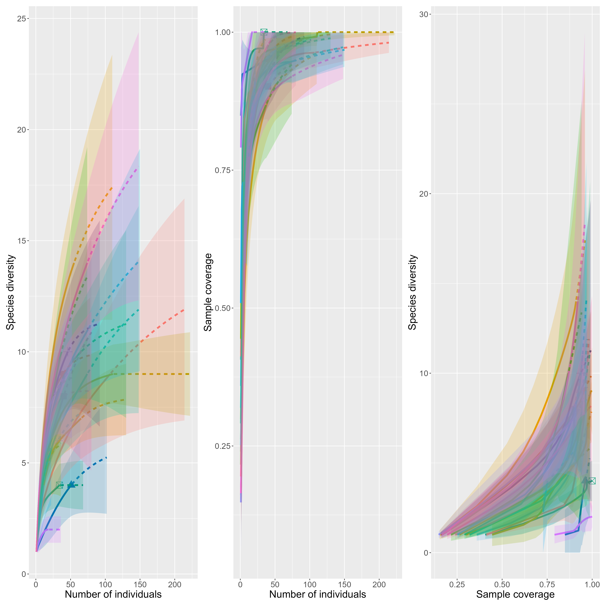
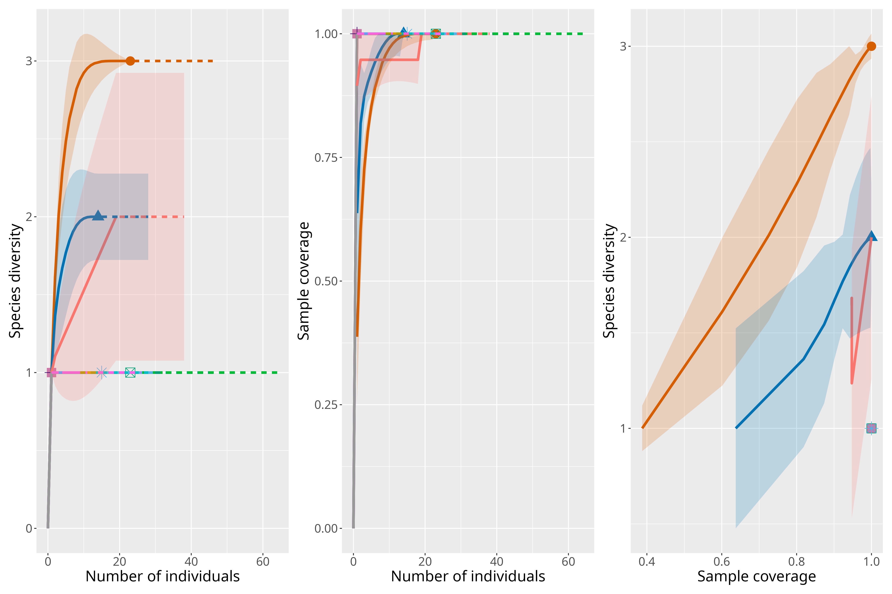

# General Notes

-   Overdispersion detected in abundance models. I have switched from Poisson to negative binomial to address the issue. New model outputs below.

# Rarefaction

We have only 4 specialist species in our study. I rareified specialists and generalists separately, to obtain different abundance/diversity metrics for each group but this may not make biological sense.

Many sites have no specialist species. Of the sites that do, most of them have only one specialist species, which makes estimation of sampling coverage not robust. All sites were determined to have a sampling coverage of 1, displaying that the rareified calculations for specialists are most likely not accurate.

The removal of the specialist species did not impact the sampling coverage of the generalist species, which was rareified to 0.7521 for comparison.

Generalists:

Specialists:

# Multicollinearity
-   Collinearity was checked before creating models. All explanatory variables have a Pearson correlation score of \< 0.5.

-   VIF scores also look fine, not sure if we want to explicitly report them or just say everything looks good.

# Sampling Area

-   Sampling area values in data sheets (used for area variable in models) do not align with the pond area descriptions in methods. Values range from 1246 to 6966. I am not sure of the units or what these values represent. Potentially the green space area surrounding the pond? I remember Jesse working to delineate that.

-   We now account for sampling area re: rarefaction (i.e., sampling coverage is dependent on the area of sampling since we had a timed survey)

-   However, we also believe that area affects butterfly community not only through sampling coverage but through a direct mechanism. We expect that ponds of different sizes will have different abundances and species composition because of their size. Therefore, I have added area to the models. Though, as stated above I am not 100% sure what the metric of area represents.

# New Model Results

# White Cabbage

# IRR Issues
